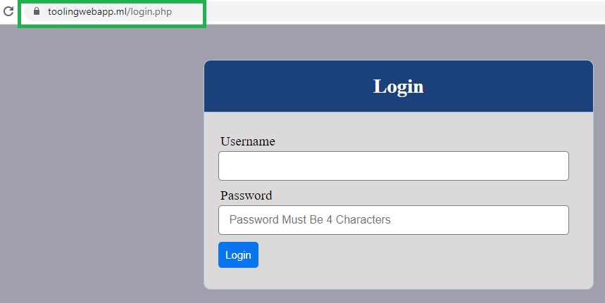

# Introduction

In this project we shall be using NGINX as a load balancer for our two web servers with secure HTTPS.

## Step 1 - CONFIGURE NGINX AS A LOAD BALANCER

1. We create an EC2 VM with Ubuntu server 20.04 LTS and name is `Nginx LB` and also allow inbound traffic on port 22 for SSH, port 80 for HTTP and port 443 for HTTPS . HTTPS is used for secure connections.
<!-- 
2. Update `/etc/hosts` file for local DNS with Web servers names as web1 and web2 with their local IP addreses

```bash
sudo nano /etc/hosts
``` -->

<!--  -->
<!-- 2. We install and configure Nginx as a load balancer to point traffic to resolvable DNS names of the s=web servers. -->

2. We update and install Nginx

```bash
sudo apt update
sudo apt install nginx
```

We now configure `Nginx LB` and create load_balancer.conf and add the web servers IP addresses.

`sudo nano /etc/nginx/sites-available/load_balancer.conf`

```bash
 upstream web {
    server 34.207.189.10;
    server 54.82.180.24;
  }

server {
    listen 80;
    server_name www.domain.com;
    location / {
      proxy_set_header X-Forwarded-For $proxy_add_x_forwarded_for;
      proxy_pass http://web;
    }
  }


```

Enable Nginx

```bash
sudo systemctl enable nginx
```

output

```bash
Synchronizing state of nginx.service with SysV service script with /lib/systemd/systemd-sysv-install.
Executing: /lib/systemd/systemd-sysv-install enable nginx
```

Restart nginx and check status

```bash
sudo systemctl restart nginx
sudo systemctl status nginx
```
 output
```bash
ubuntu@ip-172-31-4-110:~$ sudo systemctl status nginx
● nginx.service - A high performance web server and a reverse proxy server
     Loaded: loaded (/lib/systemd/system/nginx.service; enabled; vendor preset: enabled)
     Active: active (running) since Mon 2021-07-12 14:02:05 UTC; 20s ago
       Docs: man:nginx(8)
   Main PID: 14515 (nginx)
      Tasks: 2 (limit: 1160)
     Memory: 3.0M
     CGroup: /system.slice/nginx.service
             ├─14515 nginx: master process /usr/sbin/nginx -g daemon on; master_process on;
             └─14516 nginx: worker process

Jul 12 14:02:05 ip-172-31-4-110 systemd[1]: Starting A high performance web server and a reverse proxy server.>
Jul 12 14:02:05 ip-172-31-4-110 systemd[1]: Started A high performance web server and a reverse proxy server.
```

<!-- We can learn more on HTTP load balancing [here](https://docs.nginx.com/nginx/admin-guide/load-balancer/http-load-balancer/) -->

Step 2 - REGISTER A NEW DOMAIN NAME AND CONFIGURE SECURED CONNECTION USING SSL/TLS CERTIFICATES

We will now register a new domain name and configure a secure connection using SSL/TLS certificate.

1. Register a new domain e.g. Godday.com, Domain.com, Bluehost.com and myfreenom.com . Here I have registered using myfreenom.com. `toolingwebapp.ml`

2. Next we assign an Elastic IP to our Nginx LB server and associate our domain name with it. Since, we will be charged for using elastic IP, we will go ahaead with the Public IP.

3. We go to `Route 53 on AWS ` and create hosted zone


We will then need add the name servers on AWS route 53 to our free domain web host site.

On Freenom click on Management Tools and click Nameservers


Click on use custom namedservers and add the AWS Namedservers and click change the Nameservers


Now our free domain now is now connected to AWS Route53!.


Next we create `A record` on AWS Route53

click on create record


Here, our A record will be pointing to the nginx loadbalancer server.  

A record created . We add our Public IP for Nginx


Add `www` and Public IP for Nginx


Back to our Nginx server, create and edit `load_balancer.conf`

`sudo nano /etc/nginx/sites-available/load_balancer.conf` and add `toolingwebapp.ml` `www.toolingwebapp.ml` .

```bash
 upstream web {
    server 100.25.118.163;
    server 34.207.222.114;
  }

server {
    listen 80;
    server_name toolingwebapp.ml www.toolingwebapp.ml;
    location / {
      proxy_set_header X-Forwarded-For $proxy_add_x_forwarded_for;
      proxy_pass http://web;
    }
  }
```
Next we remove our default site so that nginx will point us to our newly created config file.

```bash
sudo rm -f /etc/nginx/sites-enabled/default
```

Next check if nginx is configured properly

```bash
sudo nginx -t
```
output

```bash
nginx: the configuration file /etc/nginx/nginx.conf syntax is ok
nginx: configuration file /etc/nginx/nginx.conf test is successful
```

Next cd to sites-enabled , it is now empty since we removed it above.

```bash
cd /etc/nginx/sites-enabled/
```

Now we need to link our load balancer config file we created in our sites available to our site enabled. This will aloow nginx to access our configuration and use it.

```bash
sudo ln -s ../sites-available/load_balancer.conf .
```

output

```bash
ubuntu@ip-172-31-4-110:/etc/nginx/sites-enabled$ sudo ln -s ../sites-available/load_balancer.conf .
ubuntu@ip-172-31-4-110:/etc/nginx/sites-enabled$ ls
load_balancer.conf
```
<!-- Checking to see if it is linked.
```bash
ubuntu@ip-172-31-4-110:/etc/nginx/sites-enabled$ ll
total 8
drwxr-xr-x 2 root root 4096 Jul 12 19:53 ./
drwxr-xr-x 8 root root 4096 Jul 12 19:25 ../
lrwxrwxrwx 1 root root   37 Jul 12 19:53 load_balancer.conf -> ../sites-available/load_balancer.conf
ubuntu@ip-172-31-4-110:/etc/nginx/sites-enabled$
``` -->

Reload nginx

```bash
sudo systemctl reload nginx
```

Now if we go to our domain name that we registered, it should redirect us to our webserver tooling web app.


Since we are using `http` it is not secure to make it secure we will install `certbot` and request SSL/TLS certificate.

Install certbot 

```bash
sudo apt install certbot -y
```

We install [Certbot](https://pypi.org/project/certbot/) a free encryption service that helps us to secure our connection . Certbot is an easy to use client that fetches a certificate from Let's Encrypt.

```bash
sudo apt install python3-certbot-nginx -y
```
We check syntax and reload nginx

```bash
sudo nginx -t && sudo nginx -s reload
```

output

```bash
nginx: the configuration file /etc/nginx/nginx.conf syntax is ok
nginx: configuration file /etc/nginx/nginx.conf test is successful
```
Next, we create a certificate for our domain `toolingwebapp.ml` to make it secure.

```bash
sudo certbot --nginx -d toolingwebapp.ml -d www.toolingwebapp.ml
```

output

```bash
Saving debug log to /var/log/letsencrypt/letsencrypt.log
Plugins selected: Authenticator nginx, Installer nginx
Enter email address (used for urgent renewal and security notices) (Enter 'c' to cancel): 
# singularbits@gmail.com  
tooling#gmail.com

- - - - - - - - - - - - - - - - - - - - - - - - - - - - - - - - - - - - - - - -
Please read the Terms of Service at
https://letsencrypt.org/documents/LE-SA-v1.2-November-15-2017.pdf. You must
agree in order to register with the ACME server at
https://acme-v02.api.letsencrypt.org/directory
- - - - - - - - - - - - - - - - - - - - - - - - - - - - - - - - - - - - - - - -
(A)gree/(C)ancel: A

- - - - - - - - - - - - - - - - - - - - - - - - - - - - - - - - - - - - - - - -
Would you be willing to share your email address with the Electronic Frontier
Foundation, a founding partner of the Let's Encrypt project and the non-profit
organization that develops Certbot? We'd like to send you email about our work
encrypting the web, EFF news, campaigns, and ways to support digital freedom.
- - - - - - - - - - - - - - - - - - - - - - - - - - - - - - - - - - - - - - - -
(Y)es/(N)o: Y
Obtaining a new certificate
Performing the following challenges:
http-01 challenge for toolingwebapp.ml
http-01 challenge for www.toolingwebapp.ml
Waiting for verification...
Cleaning up challenges
Deploying Certificate to VirtualHost /etc/nginx/sites-enabled/load_balancer.conf
Deploying Certificate to VirtualHost /etc/nginx/sites-enabled/load_balancer.conf

Please choose whether or not to redirect HTTP traffic to HTTPS, removing HTTP access.
- - - - - - - - - - - - - - - - - - - - - - - - - - - - - - - - - - - - - - - -
1: No redirect - Make no further changes to the webserver configuration.
2: Redirect - Make all requests redirect to secure HTTPS access. Choose this for
new sites, or if you're confident your site works on HTTPS. You can undo this
change by editing your web server's configuration.
- - - - - - - - - - - - - - - - - - - - - - - - - - - - - - - - - - - - - - - -
Select the appropriate number [1-2] then [enter] (press 'c' to cancel): 2
Redirecting all traffic on port 80 to ssl in /etc/nginx/sites-enabled/load_balancer.conf
Redirecting all traffic on port 80 to ssl in /etc/nginx/sites-enabled/load_balancer.conf

- - - - - - - - - - - - - - - - - - - - - - - - - - - - - - - - - - - - - - - -
Congratulations! You have successfully enabled https://toolingwebapp.ml and
https://www.toolingwebapp.ml

You should test your configuration at:
https://www.ssllabs.com/ssltest/analyze.html?d=toolingwebapp.ml
https://www.ssllabs.com/ssltest/analyze.html?d=www.toolingwebapp.ml
- - - - - - - - - - - - - - - - - - - - - - - - - - - - - - - - - - - - - - - -

IMPORTANT NOTES:
 - Congratulations! Your certificate and chain have been saved at:
   /etc/letsencrypt/live/toolingwebapp.ml/fullchain.pem
   Your key file has been saved at:
   /etc/letsencrypt/live/toolingwebapp.ml/privkey.pem
   Your cert will expire on 2021-10-12. To obtain a new or tweaked
   version of this certificate in the future, simply run certbot again
   with the "certonly" option. To non-interactively renew *all* of
   your certificates, run "certbot renew"
 - Your account credentials have been saved in your Certbot
   configuration directory at /etc/letsencrypt. You should make a
   secure backup of this folder now. This configuration directory will
   also contain certificates and private keys obtained by Certbot so
   making regular backups of this folder is ideal.
 - If you like Certbot, please consider supporting our work by:

   Donating to ISRG / Let's Encrypt:   https://letsencrypt.org/donate
   Donating to EFF:                    https://eff.org/donate-le

```




Next, we setup periodic renewal of our SSL/TLS certificate as its valid for 90 days . It is recommended we renew every 60days. We will use the command below to schdule a renewal 

```bash
crontab -e
```
```bash
* */12 * * *   root /usr/bin/certbot renew > /dev/null 2>&1
```

.

Congratulations we succesfully implemented Nginx Load Balancing web solution with secured HTTPS with periodic updated SSL/TLS certificate!.


