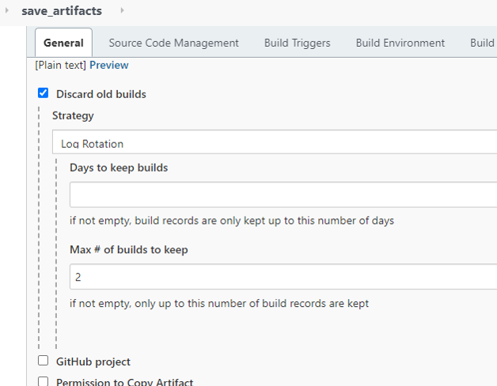
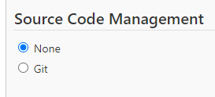
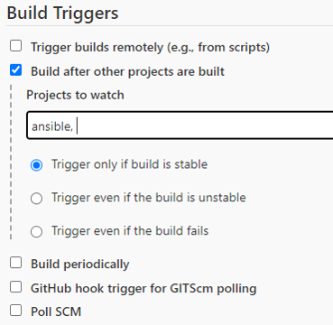
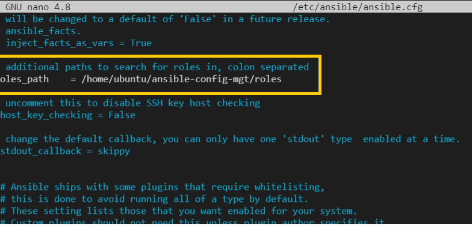

# ANSIBLE REFACTORING | ASSIGNMENTS & IMPORTS


##  **Introduction**

In this project, we shall we learning some new concept in Ansible such as `assignments`, `imports`.
Imports allows playbooks to be reuseable and helps to organize task and reuse them when needed. 
This project is a continuation of [Automating Task With Anisble and Jenkins](https://github.com/thinkC/devops-projects/blob/master/11.Ansible_configuration_Management.md).

<!-- Read more on reuseable playbook [here](https://docs.ansible.com/ansible/latest/user_guide/playbooks_reuse.html) -->

# Anisble Refactoring & Static Assignments (Imports and Roles)

## Step 1 - JENKINS JOB ENCHANCEMENT

We will improve on Jenkins setup by creating another folder which will store all our artifacts, the reason for this is because before now each time we make any new change in the code , it creates a seperate directory which will eventually consume space on the Jenkins server. We will use `Copy Artifact` plugin to achieve this.

1. On `Jenkins-Ansible` server, we create a directory named `ansible-config-artifact`. This will store all the artifacts after each build.

```bash
mkdir /home/ubuntu/ansible-config-artifact
```
Next we change permission on this directory so that Jenkins can save files in it.

```bash
chmod -R 0777 /home/ubuntu/ansible-config-artifact
```
2. Next we install the `Copy Artifact` plugin. On Jenkins web console -> Manage Jenkins -> Manage Plugin -> Click Available Tab and search for `Copy Artifact`. Click install plugin without restarting Jenkins.


3. Create a new freestyle project and name it `save_artifacts`.


Here we are keeping 2 of our build to conserve space . Number of build to keep can also be changed on the ansible job.



Choose none under source code management





The `save_artifacts` project is to save artifacts into `/home/ubuntu/ansible-config-artifact`

Click on the Build Tab under, this takes us to  Build section then  choose `Copy artifacts from other project`


Testing our setup - we will make some change on the README.md file on the main branch inside `ansible-config-mgt` repository on GutHub . 


Both Jenkins Jobs below, completed simultaneously.


Now we see all our folders and files in `ansible-config-artifact` directory.


## Step 2 - REFACTOR ANSIBLE CODE BY IMPORTING OTHER PLAYBOOKS INTO `site.yml`

<!-- Add Notes here -->

### Importing other playbooks
We login to `Jenkins-Ansible` and carry out the following:
1. Create `site.yml` file inside `playbooks` directory . File `site.yml` will now used as entry point for our entire infrastructure configuration and will serve as parent for other playbooks including `common.yml` that we created in the last project.
```bash
cd /home/ubuntu/ansible-config-mgt/playbooks
touch site.yml
```
2. Create a new folder in the root of the repository and name it `static-assignments`. We will store other children playbooks here. 
<!-- Note that this is for organizational purpose -->
```bash
mkdir static-assignments
```
3. We then move `common.yml` into `static-assignments` folder.

```bash
mv playbooks/common.yml static-assignments/ 
```
4. Inside `site.yml` file, `import common.yml` playbook

Add below to `site.yml`

```bash
---
- hosts: all
- import_playbook: ../static-assignments/common.yml

```

Now our folder structure should look like below:


Next we run Absible command on our dev environment to delete `wireshark` utility we installed in our last project. To do this, we create another playbook file inside `static-assignments` and name it `common-del.yml`.

```bash
cd static-assignments
touch common-del.yml
```
Then we add the code below to `del.yml`

```yml
---
- name: update web, nfs and db servers
  hosts: webservers, nfs, db
  remote_user: ec2-user
  become: yes
  become_user: root
  tasks:
  - name: delete wireshark
    yum:
      name: wireshark
      state: removed

- name: update LB server
  hosts: lb
  remote_user: ubuntu
  become: yes
  become_user: root
  tasks:
  - name: delete wireshark
    apt:
      name: wireshark-qt
      state: absent
      autoremove: yes
      purge: yes
      autoclean: yes
```

Next, we update by replacing `site.yml` with below and run it againt `dev` servers. Recall that our `dev.yml` has our list of servers stored in the inventory folder.

```bash
- import_playbook: ../static-assignments/common-del.yml
```

Run command below

```bash
sudo ansible-playbook -i /home/ubuntu/ansible-config-mgt/inventory/dev.yml /home/ubuntu/ansible-config-mgt/playbooks/site.yaml
```

First we run `git pull` to get all our repository changes should incase others changes has been done prior to the last time we worked on it. Then we run git status and commit changes and push to our GutHub repo.

output

```bash
ubuntu@ip-172-31-62-121:~/ansible-config-mgt$ git status
On branch main
Your branch is up to date with 'origin/main'.

Changes not staged for commit:
  (use "git add/rm <file>..." to update what will be committed)
  (use "git restore <file>..." to discard changes in working directory)
        deleted:    playbooks/common.yml
        deleted:    test

Untracked files:
  (use "git add <file>..." to include in what will be committed)
        playbooks/site.yml
        static-assignments/

no changes added to commit (use "git add" and/or "git commit -a")
ubuntu@ip-172-31-62-121:~/ansible-config-mgt$ git add .
ubuntu@ip-172-31-62-121:~/ansible-config-mgt$ git status
On branch main
Your branch is up to date with 'origin/main'.

Changes to be committed:
  (use "git restore --staged <file>..." to unstage)
        new file:   playbooks/site.yml
        new file:   static-assignments/common-del.yml
        renamed:    playbooks/common.yml -> static-assignments/common.yml
        deleted:    test

ubuntu@ip-172-31-62-121:~/ansible-config-mgt$ git commit -m "refactored ansible"
[main 138ff95] refactored ansible
 Committer: Ubuntu <ubuntu@ip-172-31-62-121.ec2.internal>
Your name and email address were configured automatically based
on your username and hostname. Please check that they are accurate.
You can suppress this message by setting them explicitly. Run the
following command and follow the instructions in your editor to edit
your configuration file:

    git config --global --edit

After doing this, you may fix the identity used for this commit with:

    git commit --amend --reset-author

 4 files changed, 28 insertions(+), 1 deletion(-)
 create mode 100644 playbooks/site.yml
 create mode 100644 static-assignments/common-del.yml
 rename {playbooks => static-assignments}/common.yml (100%)
 delete mode 100644 test
ubuntu@ip-172-31-62-121:~/ansible-config-mgt$ git status
On branch main
Your branch is ahead of 'origin/main' by 1 commit.
  (use "git push" to publish your local commits)

nothing to commit, working tree clean
ubuntu@ip-172-31-62-121:~/ansible-config-mgt$ git push
Enumerating objects: 8, done.
Counting objects: 100% (8/8), done.
Compressing objects: 100% (5/5), done.
Writing objects: 100% (6/6), 700 bytes | 350.00 KiB/s, done.
Total 6 (delta 1), reused 0 (delta 0)
remote: Resolving deltas: 100% (1/1), completed with 1 local object.
To https://github.com/thinkC/ansible-config-mgt.git
   477bc28..138ff95  main -> main
```

Once we have pushed our changes to GitHub, our Jenkins-Ansible runs and saves our files and folders to `/var/lib/jenkins/jobs/ansible/builds/9/archive`, we can then use this later to run our Ansible playbook.

Next, we run command below to run our Ansible playbook to delete `wireshark`. Notice that our build number is 9.

```bash
ansible-playbook -i /var/lib/jenkins/jobs/ansible/builds/9/archive/inventory/dev.yml /var/lib/jenkins/jobs/ansible/builds/9/archive/playbooks/site.yml
```

We can also run the command below to achive the same result

```bash
sudo ansible-playbook -i /home/ubuntu/ansible-config-mgt/inventory/dev.yml /home/ubuntu/ansible-config-mgt/playbooks/site.yml
```

output

```bash
ubuntu@ip-172-31-62-121:~/ansible-config-mgt$ ansible-playbook -i /var/lib/jenkins/jobs/ansible/builds/9/archive/inventory/dev.yml /var/lib/jenkins/jobs/ansible/builds/9/archive/playbooks/site.yml

PLAY [all] *********************************************************************************************************************************

TASK [Gathering Facts] *********************************************************************************************************************
ok: [172.31.54.139]
ok: [172.31.63.137]
ok: [172.31.48.61]
ok: [172.31.51.147]
ok: [172.31.52.115]

PLAY [update web, nfs and db servers] ******************************************************************************************************

TASK [Gathering Facts] *********************************************************************************************************************
ok: [172.31.54.139]
ok: [172.31.63.137]
ok: [172.31.51.147]
ok: [172.31.52.115]

TASK [delete wireshark] ********************************************************************************************************************
fatal: [172.31.52.115]: FAILED! => {"ansible_facts": {"pkg_mgr": "apt"}, "changed": false, "msg": "value of state must be one of: absent, build-dep, fixed, latest, present, got: removed"}
changed: [172.31.51.147]
changed: [172.31.63.137]
changed: [172.31.54.139]

PLAY [update LB server] ********************************************************************************************************************

TASK [Gathering Facts] *********************************************************************************************************************
ok: [172.31.48.61]

TASK [delete wireshark] ********************************************************************************************************************
changed: [172.31.48.61]

PLAY RECAP *********************************************************************************************************************************
172.31.48.61               : ok=3    changed=1    unreachable=0    failed=0    skipped=0    rescued=0    ignored=0   
172.31.51.147              : ok=3    changed=1    unreachable=0    failed=0    skipped=0    rescued=0    ignored=0   
172.31.52.115              : ok=2    changed=0    unreachable=0    failed=1    skipped=0    rescued=0    ignored=0   
172.31.54.139              : ok=3    changed=1    unreachable=0    failed=0    skipped=0    rescued=0    ignored=0   
172.31.63.137              : ok=3    changed=1    unreachable=0    failed=0    skipped=0    rescued=0    ignored=0   

ubuntu@ip-172-31-62-121:~/ansible-config-mgt$ 
```

**Note**
I got this error `value of state must be one of: absent` for database server. Though the task says _state: absent_ which is correct, Not sure where Ansible got _removed_ for Ubuntu. Not able to find a fix yet but will still investigate.

```yml
- name: update LB server
  hosts: lb
  remote_user: ubuntu
  become: yes
  become_user: root
  tasks:
  - name: delete wireshark
    apt:
      name: wireshark-qt
      state: absent
      autoremove: yes
      purge: yes
      autoclean: yes
```

## Step 3 - CONFIGURE UAT WEBSERVERS WITH A ROLE **WEBSERVER**

Next, we move to `uat` - User Acceptance Testing phase of our development. Here, we will create two web servers as `uat` . We will be using [roles](https://docs.ansible.com/ansible/latest/user_guide/playbooks_reuse_roles.html) to make our configuration reuseable. 

<!-- we could also write our task in the same playbook -->

1. We create two Red Hat Enterprise Linux 8 EC2 instances and name them `Web1-UAT` and `Web2-UAT`.

We have these setup now.


2. Next we create roles in `/home/ubuntu/ansible-config-mgt` and use `ansible-galaxy init` to create other folders and files. These folders and files can also be created manually.

```bash
mkdir roles
cd roles
ansible-galaxy init webserver
```

```bash
ubuntu@ip-172-31-62-121:~/ansible-config-mgt/roles/webserver$ ls -l
total 36
-rw-rw-r-- 1 ubuntu ubuntu 1328 Jul 19 18:47 README.md
drwxrwxr-x 2 ubuntu ubuntu 4096 Jul 19 18:47 defaults
drwxrwxr-x 2 ubuntu ubuntu 4096 Jul 19 18:47 files
drwxrwxr-x 2 ubuntu ubuntu 4096 Jul 19 18:47 handlers
drwxrwxr-x 2 ubuntu ubuntu 4096 Jul 19 18:47 meta
drwxrwxr-x 2 ubuntu ubuntu 4096 Jul 19 18:47 tasks
drwxrwxr-x 2 ubuntu ubuntu 4096 Jul 19 18:47 templates
drwxrwxr-x 2 ubuntu ubuntu 4096 Jul 19 18:47 tests
drwxrwxr-x 2 ubuntu ubuntu 4096 Jul 19 18:47 vars
ubuntu@ip-172-31-62-121:~/ansible-config-mgt/roles/webserver$ 
```


3. Next we update our `ansible-config-mgt/inventory/uat.yml` with codes below

```bash
[uat-webservers]
<Web1-UAT-Server-Private-IP-Address> ansible_ssh_user='ec2-user' ansible_ssh_private_key_file=<path-to-.pem-private-key>
<Web2-UAT-Server-Private-IP-Address> ansible_ssh_user='ec2-user' ansible_ssh_private_key_file=<path-to-.pem-private-key>
```


4. Uncomment roles_path string in `/etc/ansible/ansible.cfg` so that Ansible will able to locate roles.
Our role path is :

```bash
roles_path    = /home/ubuntu/ansible-config-mgt/roles
```



5. Next , add logic to the webserver roles. We add tasks below to the `main.yml` file under roles sub directory

```bash
ubuntu@ip-172-31-62-121:~/ansible-config-mgt$ ls -l roles/webserver/tasks
total 4
-rw-rw-r-- 1 ubuntu ubuntu 718 Jul 19 19:56 main.yml
```

### Tasks
- Install and configure Apache (httpd service)
- Clone Tooling Website from GitHub (https://github.com/<your-name>/tooling.git)
- Ensure the tooling website code is deployed to /var/www/html on each of 2 UAT Web servers
- Make sure httpd service is started

Add below to `main.yml`.

```yml
---
- name: install apache
  become: true
  ansible.builtin.yum:
    name: "httpd"
    state: present

- name: install git
  become: true
  ansible.builtin.yum:
    name: "git"
    state: present

- name: clone a repo
  become: true
  ansible.builtin.git:
    repo: https://github.com/<your-name>/tooling.git
    dest: /var/www/html
    force: yes

- name: copy html content to one level up
  become: true
  command: cp -r /var/www/html/html/ /var/www/

- name: Start service httpd, if not started
  become: true
  ansible.builtin.service:
    name: httpd
    state: started

- name: recursively remove /var/www/html/html/ directory
  become: true
  ansible.builtin.file:
    path: /var/www/html/html
    state: absent
```

### REFERENCE WEBSERVER ROLE

## Step 4 - Reference ‘Webserver’ role

In `static-assignments` , we create a new assignment for `uat-webservers` named `uat-webservers.yml`.

```bash
cd static-assignments
touch uat-webservers.yml
```

Add below to `uat-webservers.yml`

```yml
---
- hosts: uat-webservers
  roles:
     - webserver
```

Recall that our entry point to our Ansible configuration is `site.yml`, hence we need to refer to our `uat-webservers.yml` insude `site.yml`.
Add below to `site.yml`

```yml
---
- hosts: all
- import_playbook: ../static-assignments/common.yml

- hosts: uat-webservers
- import_playbook: ../static-assignments/uat-webservers.yml
```

Step 6 - Commit & Test

Finally we commit all our changes to GitHub on the main branch. Once the changes are commited , WebHook will trigger Jobs in Jenkins, which will copy all updated folders and files to our Jenkins-Ansible server directory `/home/ubuntu/ansible-config-mgt/`.

output for Git

```bash
ubuntu@ip-172-31-62-121:~/ansible-config-mgt$ git pull
Already up to date.
ubuntu@ip-172-31-62-121:~/ansible-config-mgt$ git status
On branch main
Your branch is up to date with 'origin/main'.

Changes not staged for commit:
  (use "git add <file>..." to update what will be committed)
  (use "git restore <file>..." to discard changes in working directory)
        modified:   inventory/uat.yml
        modified:   playbooks/site.yml

Untracked files:
  (use "git add <file>..." to include in what will be committed)
        roles/
        static-assignments/uat-webservers.yml

no changes added to commit (use "git add" and/or "git commit -a")
ubuntu@ip-172-31-62-121:~/ansible-config-mgt$ git add .
ubuntu@ip-172-31-62-121:~/ansible-config-mgt$ git status
On branch main
Your branch is up to date with 'origin/main'.

Changes to be committed:
  (use "git restore --staged <file>..." to unstage)
        modified:   inventory/uat.yml
        modified:   playbooks/site.yml
        new file:   roles/webserver/.travis.yml
        new file:   roles/webserver/README.md
        new file:   roles/webserver/defaults/main.yml
        new file:   roles/webserver/handlers/main.yml
        new file:   roles/webserver/meta/main.yml
        new file:   roles/webserver/tasks/main.yml
        new file:   roles/webserver/tests/inventory
        new file:   roles/webserver/tests/test.yml
        new file:   roles/webserver/vars/main.yml
        new file:   static-assignments/uat-webservers.yml

ubuntu@ip-172-31-62-121:~/ansible-config-mgt$ git commit -m "added ansible roles"
[main 232a87f] added ansible roles
 Committer: Ubuntu <ubuntu@ip-172-31-62-121.ec2.internal>
Your name and email address were configured automatically based
on your username and hostname. Please check that they are accurate.
You can suppress this message by setting them explicitly. Run the
following command and follow the instructions in your editor to edit
your configuration file:

    git config --global --edit

After doing this, you may fix the identity used for this commit with:

    git commit --amend --reset-author

 12 files changed, 179 insertions(+), 1 deletion(-)
 create mode 100644 roles/webserver/.travis.yml
 create mode 100644 roles/webserver/README.md
 create mode 100644 roles/webserver/defaults/main.yml
 create mode 100644 roles/webserver/handlers/main.yml
 create mode 100644 roles/webserver/meta/main.yml
 create mode 100644 roles/webserver/tasks/main.yml
 create mode 100644 roles/webserver/tests/inventory
 create mode 100644 roles/webserver/tests/test.yml
 create mode 100644 roles/webserver/vars/main.yml
 create mode 100644 static-assignments/uat-webservers.yml
ubuntu@ip-172-31-62-121:~/ansible-config-mgt$ git status
On branch main
Your branch is ahead of 'origin/main' by 1 commit.
  (use "git push" to publish your local commits)

nothing to commit, working tree clean
ubuntu@ip-172-31-62-121:~/ansible-config-mgt$ git push
Enumerating objects: 31, done.
Counting objects: 100% (31/31), done.
Compressing objects: 100% (14/14), done.
Writing objects: 100% (25/25), 3.65 KiB | 287.00 KiB/s, done.
Total 25 (delta 1), reused 0 (delta 0)
remote: Resolving deltas: 100% (1/1), completed with 1 local object.
To https://github.com/thinkC/ansible-config-mgt.git
   7f4acae..232a87f  main -> main
  ```
Next we run the playbook against our `uat` inventory.

```bash
ansible-playbook -i /var/lib/jenkins/jobs/ansible/builds/11/archive/inventory/uat.yml /var/lib/jenkins/jobs/ansible/builds/11/archive/playbooks/site.yml
```

Below commad will also give the same result

```bash
sudo ansible-playbook -i /home/ubuntu/ansible-config-mgt/inventory/uat.yml /home/ubuntu/ansible-config-mgt/playbooks/site.yaml
```

Both jobs in Jenkins are successful and files and folders copied.


output for Ansible

```javascript
[DEPRECATION WARNING]: The TRANSFORM_INVALID_GROUP_CHARS settings is set to allow bad characters in 
group names by default, this will change, but still be user configurable on deprecation. This feature 
will be removed in version 2.10. Deprecation warnings can be disabled by setting 
deprecation_warnings=False in ansible.cfg.
[WARNING]: Invalid characters were found in group names but not replaced, use -vvvv to see details

PLAY [all] *********************************************************************************************

TASK [Gathering Facts] *********************************************************************************
The authenticity of host '172.31.51.254 (172.31.51.254)' can't be established.
ECDSA key fingerprint is SHA256:+pcBXYeHSWXMQqCnFgockN2zFhYeGgkyRVGQ4M5RJe4.
The authenticity of host '172.31.57.143 (172.31.57.143)' can't be established.
ECDSA key fingerprint is SHA256:IzVTi8AMAV/0eYvD/5HMDoUi5DIhkAApZQRPzGTqW/w.
Are you sure you want to continue connecting (yes/no/[fingerprint])? yes
ok: [172.31.51.254]

fatal: [172.31.57.143]: UNREACHABLE! => {"changed": false, "msg": "Failed to connect to the host via ssh: Host key verification failed.", "unreachable": true}
[WARNING]: Could not match supplied host pattern, ignoring: webservers
[WARNING]: Could not match supplied host pattern, ignoring: nfs
[WARNING]: Could not match supplied host pattern, ignoring: db

PLAY [update web, nfs and db servers] ******************************************************************
skipping: no hosts matched
[WARNING]: Could not match supplied host pattern, ignoring: lb

PLAY [update LB server] ********************************************************************************
skipping: no hosts matched

PLAY [uat-webservers] **********************************************************************************

TASK [Gathering Facts] *********************************************************************************
ok: [172.31.51.254]

PLAY [uat-webservers] **********************************************************************************

TASK [Gathering Facts] *********************************************************************************
ok: [172.31.51.254]

TASK [webserver : install apache] **********************************************************************
changed: [172.31.51.254]

TASK [webserver : install git] *************************************************************************

changed: [172.31.51.254]

TASK [webserver : clone a repo] ************************************************************************
changed: [172.31.51.254]

TASK [webserver : copy html content to one level up] ***************************************************
changed: [172.31.51.254]

TASK [webserver : Start service httpd, if not started] *************************************************
changed: [172.31.51.254]

TASK [webserver : recursively remove /var/www/html/html/ directory] ************************************
changed: [172.31.51.254]

PLAY RECAP *********************************************************************************************
172.31.51.254              : ok=9    changed=6    unreachable=0    failed=0    skipped=0    rescued=0    ignored=0   
172.31.57.143              : ok=0    changed=0    unreachable=1    failed=0    skipped=0    rescued=0    ignored=0   

ubuntu@ip-172-31-62-121:~/ansible-config-mgt$ 
```

On second attemp , Web2-UAT also ran successfully

```javascript
ubuntu@ip-172-31-62-121:~/ansible-config-mgt$ ansible-playbook -i /var/lib/jenkins/jobs/ansible/builds/11/archive/inventory/uat.yml /var/lib/jenkins/jobs/ansible/builds/11/archive/playbooks/site.yml
[DEPRECATION WARNING]: The TRANSFORM_INVALID_GROUP_CHARS settings is set to allow bad characters in 
group names by default, this will change, but still be user configurable on deprecation. This feature 
will be removed in version 2.10. Deprecation warnings can be disabled by setting 
deprecation_warnings=False in ansible.cfg.
[WARNING]: Invalid characters were found in group names but not replaced, use -vvvv to see details

PLAY [all] *********************************************************************************************

TASK [Gathering Facts] *********************************************************************************
ok: [172.31.51.254]
ok: [172.31.57.143]
[WARNING]: Could not match supplied host pattern, ignoring: webservers
[WARNING]: Could not match supplied host pattern, ignoring: nfs
[WARNING]: Could not match supplied host pattern, ignoring: db

PLAY [update web, nfs and db servers] ******************************************************************
skipping: no hosts matched
[WARNING]: Could not match supplied host pattern, ignoring: lb

PLAY [update LB server] ********************************************************************************
skipping: no hosts matched

PLAY [uat-webservers] **********************************************************************************

TASK [Gathering Facts] *********************************************************************************
ok: [172.31.51.254]
ok: [172.31.57.143]

PLAY [uat-webservers] **********************************************************************************

TASK [Gathering Facts] *********************************************************************************
ok: [172.31.51.254]
ok: [172.31.57.143]

TASK [webserver : install apache] **********************************************************************
ok: [172.31.51.254]
changed: [172.31.57.143]

TASK [webserver : install git] *************************************************************************
ok: [172.31.51.254]
changed: [172.31.57.143]

TASK [webserver : clone a repo] ************************************************************************
changed: [172.31.51.254]
changed: [172.31.57.143]

TASK [webserver : copy html content to one level up] ***************************************************
changed: [172.31.51.254]
changed: [172.31.57.143]

TASK [webserver : Start service httpd, if not started] *************************************************
ok: [172.31.51.254]
changed: [172.31.57.143]

TASK [webserver : recursively remove /var/www/html/html/ directory] ************************************
changed: [172.31.51.254]
changed: [172.31.57.143]

PLAY RECAP *********************************************************************************************
172.31.51.254              : ok=9    changed=3    unreachable=0    failed=0    skipped=0    rescued=0    ignored=0   
172.31.57.143              : ok=9    changed=6    unreachable=0    failed=0    skipped=0    rescued=0    ignored=0   

ubuntu@ip-172-31-62-121:~/ansible-config-mgt$ 
```

Testing to see if web servers are configured.

We try reaching both web servers 

```bash
http://<Web1-UAT-Server-Public-IP-or-Public-DNS-Name>/index.php
```
OR

```bash
http://<Web1-UAT-Server-Public-IP-or-Public-DNS-Name>/index.php
```

Rememeber to open HTTP port 80 on both web servers


Web1-UAT


Web2-UAT


Congratulations we have been able to configure Web servers using Ansible import and Roles.