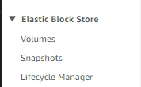
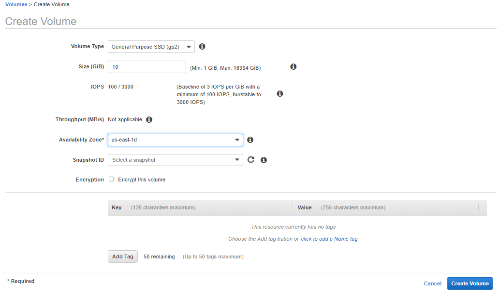
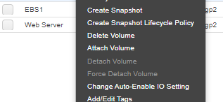
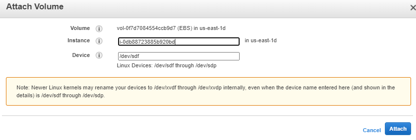

# Implementing Web Solutions with Wordpress on AWS

This project involves creating storage infrastructures on two Linux servers and implementing web solutions using [Wordpress](https://en.wikipedia.org/wiki/WordPress) . Wordpress is a free and open-source content management system written in PHP and paired with MySQL or MariaDB as its backend Relational Database Management System (RDBMS).

Our setup will include:
1. A PC that servers as client
2. A Linux server where we will install wordpress
3. A Linux server that will serve as a database

Note our Linux servers will be hosted on Amaon AWS EC2.

We start by creating an _EC2_ server on AWS and name it _Web Server_.

add steps to create EC2 here...

Next, we create 3 volumes and add to our _Web Server_.

Click on Volume on _Elastic Block Store_.


Click create volume, change size to 10GB, and choose availability zone that is same location with the server . We will repeat this step of creating volumes two more times to create 3 volumes.



Choose the new VM _Web Server_ and click attach



Next connect to the VM server _web server_ with ssh

```bash
ssh -i C:\Users\user1\Desktop\Downloads\mysingular-EC2.pem ec2-user@52.23.233.125
```
List all blcok to see if it is listed.

```bash
lsblk
```
output

```bash
NAME    MAJ:MIN RM SIZE RO TYPE MOUNTPOINT
xvda    202:0    0   8G  0 disk
└─xvda1 202:1    0   8G  0 part /
xvdf    202:80   0  10G  0 disk
xvdg    202:96   0  10G  0 disk
xvdh    202:112  0  10G  0 disk
```
They are listed as _xvdf_, _xvdg_, _xvdh_ .

Next, we run `df -h` to see all the mounts and free space on the web server

 output
```bash
Filesystem      Size  Used Avail Use% Mounted on
devtmpfs        482M     0  482M   0% /dev
tmpfs           492M     0  492M   0% /dev/shm
tmpfs           492M  476K  492M   1% /run
tmpfs           492M     0  492M   0% /sys/fs/cgroup
/dev/xvda1      8.0G  1.5G  6.6G  18% /
tmpfs            99M     0   99M   0% /run/user/1000
tmpfs            99M     0   99M   0% /run/user/0
```
Next, we create a single partition on each of the 3 disks.

```bash
sudo gdisk /dev/xvdf
sudo gdisk /dev/xvdg
sudo gdisk /dev/xvdh
```

output

```bash
GPT fdisk (gdisk) version 0.8.10

Partition table scan:
  MBR: not present
  BSD: not present
  APM: not present
  GPT: not present

Creating new GPT entries.

Command (? for help): 
```
Typing '?' shows the menus. Her

```bash
Command (? for help): ?
b       back up GPT data to a file
c       change a partition's name
d       delete a partition
i       show detailed information on a partition
l       list known partition types
n       add a new partition
o       create a new empty GUID partition table (GPT)
p       print the partition table
q       quit without saving changes
r       recovery and transformation options (experts only)
s       sort partitions
t       change a partition's type code
v       verify disk
w       write table to disk and exit
x       extra functionality (experts only)
?       print this menu

Command (? for help): 
```

We choose 'n' to create new Partition.

output

```bash
Command (? for help): n
Partition number (1-128, default 1):
First sector (34-20971486, default = 2048) or {+-}size{KMGTP}:
Last sector (2048-20971486, default = 20971486) or {+-}size{KMGTP}:
Current type is 'Linux filesystem'
```

Type 'l'small 'l' or big 'L' to show codes

output
```bash
Hex code or GUID (L to show codes, Enter = 8300): l
0700 Microsoft basic data  0c01 Microsoft reserved    2700 Windows RE
3000 ONIE boot             3001 ONIE config           4100 PowerPC PReP boot
4200 Windows LDM data      4201 Windows LDM metadata  7501 IBM GPFS
7f00 ChromeOS kernel       7f01 ChromeOS root         7f02 ChromeOS reserved
8200 Linux swap            8300 Linux filesystem      8301 Linux reserved
8302 Linux /home           8400 Intel Rapid Start     8e00 Linux LVM
a500 FreeBSD disklabel     a501 FreeBSD boot          a502 FreeBSD swap
a503 FreeBSD UFS           a504 FreeBSD ZFS           a505 FreeBSD Vinum/RAID
a580 Midnight BSD data     a581 Midnight BSD boot     a582 Midnight BSD swap
a583 Midnight BSD UFS      a584 Midnight BSD ZFS      a585 Midnight BSD Vinum
a800 Apple UFS             a901 NetBSD swap           a902 NetBSD FFS
a903 NetBSD LFS            a904 NetBSD concatenated   a905 NetBSD encrypted
a906 NetBSD RAID           ab00 Apple boot            af00 Apple HFS/HFS+
af01 Apple RAID            af02 Apple RAID offline    af03 Apple label
af04 AppleTV recovery      af05 Apple Core Storage    be00 Solaris boot
bf00 Solaris root          bf01 Solaris /usr & Mac Z  bf02 Solaris swap
bf03 Solaris backup        bf04 Solaris /var          bf05 Solaris /home
bf06 Solaris alternate se  bf07 Solaris Reserved 1    bf08 Solaris Reserved 2
bf09 Solaris Reserved 3    bf0a Solaris Reserved 4    bf0b Solaris Reserved 5
c001 HP-UX data            c002 HP-UX service         ea00 Freedesktop $BOOT
eb00 Haiku BFS             ed00 Sony system partitio  ed01 Lenovo system partit
Press the <Enter> key to see more codes:
ef00 EFI System            ef01 MBR partition scheme  ef02 BIOS boot partition
fb00 VMWare VMFS           fb01 VMWare reserved       fc00 VMWare kcore crash p
fd00 Linux RAID           
```
Type _8e00_ to choose Linux LVM

```bash
Hex code or GUID (L to show codes, Enter = 8300): 8e00
Changed type of partition to 'Linux LVM'

Command (? for help): p
Disk /dev/xvdf: 20971520 sectors, 10.0 GiB
Logical sector size: 512 bytes
Disk identifier (GUID): A7345FC4-B5D7-45FE-B76E-55FCFE1BDB26
Partition table holds up to 128 entries
First usable sector is 34, last usable sector is 20971486
Partitions will be aligned on 2048-sector boundaries
Total free space is 2014 sectors (1007.0 KiB)

Number  Start (sector)    End (sector)  Size       Code  Name
   1            2048        20971486   10.0 GiB    8E00  Linux LVM

Command (? for help): 
```
Type 'w' to write and 'Y' tp proceed.

```bash
Command (? for help): w

Final checks complete. About to write GPT data. THIS WILL OVERWRITE EXISTING
PARTITIONS!!

Do you want to proceed? (Y/N): Y
OK; writing new GUID partition table (GPT) to /dev/xvdf.
The operation has completed successfully.
```

Do the same procedure for other two disks

Run command below to view the newly configured partition on each of the 3 disks

```bash
lsblk
```

output

```bash
NAME    MAJ:MIN RM SIZE RO TYPE MOUNTPOINT
xvda    202:0    0   8G  0 disk
└─xvda1 202:1    0   8G  0 part /
xvdf    202:80   0  10G  0 disk
└─xvdf1 202:81   0  10G  0 part
xvdg    202:96   0  10G  0 disk
└─xvdg1 202:97   0  10G  0 part
xvdh    202:112  0  10G  0 disk
└─xvdh1 202:113  0  10G  0 part
```


