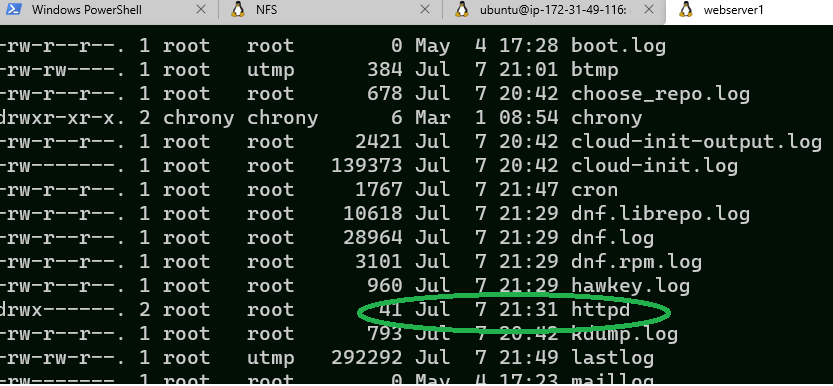

## Step 1 - Create and prepare NFS Server

1. Create NFS Server (Network File System) with RHEL 8 as OS
2. Create 3 Logical Volume on the NFS server _lv-opt lv-apps, and lv-logs_

You can learn how to create Logic Volume in this [tutorial](https://github.com/thinkC/devops-projects/blob/master/6.Web_Solutions_WordPress_AWS.md).


First we login to the NFS Server

```bash
ssh -i pem/mysingular-EC2.pem ec2-user@100.26.246.37
```

Checking the Volumes added

```bash
[ec2-user@ip-172-31-55-116 ~]$ lsblk
NAME    MAJ:MIN RM SIZE RO TYPE MOUNTPOINT
xvda    202:0    0  10G  0 disk
├─xvda1 202:1    0   1M  0 part
└─xvda2 202:2    0  10G  0 part /
xvdf    202:80   0  10G  0 disk
xvdg    202:96   0  10G  0 disk
xvdh    202:112  0  10G  0 disk
```

Checking the current mounted devices

```bash
[ec2-user@ip-172-31-55-116 ~]$ df -h
Filesystem      Size  Used Avail Use% Mounted on
devtmpfs        377M     0  377M   0% /dev
tmpfs           404M     0  404M   0% /dev/shm
tmpfs           404M   11M  393M   3% /run
tmpfs           404M     0  404M   0% /sys/fs/cgroup
/dev/xvda2       10G  1.3G  8.8G  13% /
tmpfs            81M     0   81M   0% /run/user/1000
```

We create a single partition on each of teh 3 disks

```bash
sudo gdisk /dev/xvdf
sudo gdisk /dev/xvdg
sudo gdisk /dev/xvdh

```

output

```bash
[ec2-user@ip-172-31-55-116 ~]$ sudo gdisk /dev/xvdf
GPT fdisk (gdisk) version 1.0.3

Partition table scan:
  MBR: not present
  BSD: not present
  APM: not present
  GPT: not present

Creating new GPT entries.

Command (? for help): n
Partition number (1-128, default 1):
First sector (34-20971486, default = 2048) or {+-}size{KMGTP}:
Last sector (2048-20971486, default = 20971486) or {+-}size{KMGTP}:
Current type is 'Linux filesystem'
Hex code or GUID (L to show codes, Enter = 8300): 8e00
Changed type of partition to 'Linux LVM'

Command (? for help): w

Final checks complete. About to write GPT data. THIS WILL OVERWRITE EXISTING
PARTITIONS!!

Do you want to proceed? (Y/N): Y
OK; writing new GUID partition table (GPT) to /dev/xvdf.
The operation has completed successfully.
```

Check the created disk

```bash
lsblk
```

output

```bash
[ec2-user@ip-172-31-55-116 ~]$ lsblk
NAME    MAJ:MIN RM SIZE RO TYPE MOUNTPOINT
xvda    202:0    0  10G  0 disk
├─xvda1 202:1    0   1M  0 part
└─xvda2 202:2    0  10G  0 part /
xvdf    202:80   0  10G  0 disk
└─xvdf1 202:81   0  10G  0 part
xvdg    202:96   0  10G  0 disk
└─xvdg1 202:97   0  10G  0 part
xvdh    202:112  0  10G  0 disk
└─xvdh1 202:113  0  10G  0 part
```

Install _lvm2_ to check partition

```bash
sudo yum install lvm2
```

### Create Logical Volume

1. Run pvcreate utility to mark each 3 disks as a physical volume (PVs)
```bash
sudo pvcreate /dev/xvdf1
sudo pvcreate /dev/xvdg1
sudo pvcreate /dev/xvdh1
```

output

```bash
[ec2-user@ip-172-31-55-116 ~]$ sudo pvcreate /dev/xvdf1
  Physical volume "/dev/xvdf1" successfully created.
[ec2-user@ip-172-31-55-116 ~]$ sudo pvcreate /dev/xvdg1
  Physical volume "/dev/xvdg1" successfully created.
[ec2-user@ip-172-31-55-116 ~]$ sudo pvcreate /dev/xvdh1
  Physical volume "/dev/xvdh1" successfully created.
```
2. Verify our Physical volume is created
```bash
sudo pvs
```

output

```bash
PV         VG Fmt  Attr PSize   PFree
  /dev/xvdf1    lvm2 ---  <10.00g <10.00g
  /dev/xvdg1    lvm2 ---  <10.00g <10.00g
  /dev/xvdh1    lvm2 ---  <10.00g <10.00g
```
3. Use vgcreate utility to add all 3 Physocal Volumes to a Volume group (VG) , name the VG as nfs-vg .

```bash
sudo vgcreate nfs-vg /dev/xvdf1 /dev/xvdg1 /dev/xvdh1
```

output

```bash
Volume group "nfs-vg" successfully created
```

Verify the Volume Group is created.
```bash
sudo vgs
```

output

```bash
nfs-vg   3   0   0 wz--n- <29.99g <29.99g
```

4. Use lvcreate utility to create 3 logical volumes named lv-opt, lv-apps and lv-logs . We make lv-apps as 14G, lv-logs - 7G, lv-opt - 6G.

```bash
sudo lvcreate -n lv-apps -L 14G nfs-vg
sudo lvcreate -n lv-logs -L 7G nfs-vg
sudo lvcreate -n lv-opt -L 6G nfs-vg
```

output

```bash
[ec2-user@ip-172-31-55-116 ~]$ sudo lvcreate -n lv-apps -L 14G nfs-vg
  Logical volume "lv-apps" created.
[ec2-user@ip-172-31-55-116 ~]$ sudo lvcreate -n lv-logs -L 7G nfs-vg
  Logical volume "lv-logs" created.
[ec2-user@ip-172-31-55-116 ~]$ sudo lvcreate -n lv-opt -L 6G nfs-vg
  Logical volume "lv-opt" created.
[ec2-user@ip-172-31-55-116 ~]$
```
We, verify that our Logical Volume is created successfully.

```bash
sudo lvs
```

output

```bash
LV      VG     Attr       LSize  Pool Origin Data%  Meta%  Move Log Cpy%Sync Convert
  lv-apps nfs-vg -wi-a----- 14.00g
  lv-logs nfs-vg -wi-a-----  7.00g
  lv-opt  nfs-vg -wi-a-----  6.00g
```

Verify the entire setup

```bash
sudo vgdisplay -v
```

output

```bash
--- Volume group ---
  VG Name               nfs-vg
  System ID
  Format                lvm2
  Metadata Areas        3
  Metadata Sequence No  4
  VG Access             read/write
  VG Status             resizable
  MAX LV                0
  Cur LV                3
  Open LV               0
  Max PV                0
  Cur PV                3
  Act PV                3
  VG Size               <29.99 GiB
  PE Size               4.00 MiB
  Total PE              7677
  Alloc PE / Size       6912 / 27.00 GiB
  Free  PE / Size       765 / <2.99 GiB
  VG UUID               A4PZgk-wvPR-1L5g-52ua-GR9d-HkS9-zKtU12

  --- Logical volume ---
  LV Path                /dev/nfs-vg/lv-apps
  LV Name                lv-apps
  VG Name                nfs-vg
  LV UUID                wIoaof-mszd-RMB2-MT3s-FpuD-GXs7-uZGltD
  LV Write Access        read/write
  LV Creation host, time ip-172-31-55-116.ec2.internal, 2021-07-07 10:27:52 +0000
  LV Status              available
  # open                 0
  LV Size                14.00 GiB
  Current LE             3584
  Segments               2
  Allocation             inherit
  Read ahead sectors     auto
  - currently set to     8192
  Block device           253:0

  --- Logical volume ---
  LV Path                /dev/nfs-vg/lv-logs
  LV Name                lv-logs
  VG Name                nfs-vg
  LV UUID                XbQndD-XQ5y-4Tbh-yME8-TDBz-P8I2-5eMVXe
  LV Write Access        read/write
  LV Creation host, time ip-172-31-55-116.ec2.internal, 2021-07-07 10:28:17 +0000
  LV Status              available
  # open                 0
  LV Size                7.00 GiB
  Current LE             1792
  Segments               1
  Allocation             inherit
  Read ahead sectors     auto
  - currently set to     8192
  Block device           253:1

  --- Logical volume ---
  LV Path                /dev/nfs-vg/lv-opt
  LV Name                lv-opt
  VG Name                nfs-vg
  LV UUID                v33ijN-kDGO-UhOd-G0i4-a1jR-aWgd-dnei9m
  LV Write Access        read/write
  LV Creation host, time ip-172-31-55-116.ec2.internal, 2021-07-07 10:28:40 +0000
  LV Status              available
  # open                 0
  LV Size                6.00 GiB
  Current LE             1536
  Segments               2
  Allocation             inherit
  Read ahead sectors     auto
  - currently set to     8192
  Block device           253:2

  --- Physical volumes ---
  PV Name               /dev/xvdf1
  PV UUID               kn4AtU-ycq1-y2cN-Tx69-Ps7s-ZcpG-lWgkCs
  PV Status             allocatable
  Total PE / Free PE    2559 / 0

  PV Name               /dev/xvdg1
  PV UUID               PyeZVv-ftL5-dgYe-IAzp-P6gv-A0HE-r1tYtB
  PV Status             allocatable
  Total PE / Free PE    2559 / 0

  PV Name               /dev/xvdh1
  PV UUID               l0091M-Kikp-4Anl-6Z6g-zcy9-Fpiy-eITDeQ
  PV Status             allocatable
  Total PE / Free PE    2559 / 765
  ```

  run  _sudo lsblk_

  output

  ```bash
  NAME                 MAJ:MIN RM SIZE RO TYPE MOUNTPOINT
xvda                 202:0    0  10G  0 disk
├─xvda1              202:1    0   1M  0 part
└─xvda2              202:2    0  10G  0 part /
xvdf                 202:80   0  10G  0 disk
└─xvdf1              202:81   0  10G  0 part
  └─nfs--vg-lv--apps 253:0    0  14G  0 lvm
xvdg                 202:96   0  10G  0 disk
└─xvdg1              202:97   0  10G  0 part
  ├─nfs--vg-lv--apps 253:0    0  14G  0 lvm
  └─nfs--vg-lv--opt  253:2    0   6G  0 lvm
xvdh                 202:112  0  10G  0 disk
└─xvdh1              202:113  0  10G  0 part
  ├─nfs--vg-lv--logs 253:1    0   7G  0 lvm
  └─nfs--vg-lv--opt  253:2    0   6G  0 lvm
```

5. Format the logical volumes with xfs filesystem .

```bash
sudo mkfs -t xfs /dev/nfs-vg/lv-apps
sudo mkfs -t xfs /dev/nfs-vg/lv-logs
sudo mkfs -t xfs /dev/nfs-vg/lv-opt
```
output

```bash
meta-data=/dev/nfs-vg/lv-apps    isize=512    agcount=4, agsize=917504 blks
         =                       sectsz=512   attr=2, projid32bit=1
         =                       crc=1        finobt=1, sparse=1, rmapbt=0
         =                       reflink=1
data     =                       bsize=4096   blocks=3670016, imaxpct=25
         =                       sunit=0      swidth=0 blks
naming   =version 2              bsize=4096   ascii-ci=0, ftype=1
log      =internal log           bsize=4096   blocks=2560, version=2
         =                       sectsz=512   sunit=0 blks, lazy-count=1
realtime =none                   extsz=4096   blocks=0, rtextents=0
[ec2-user@ip-172-31-55-116 ~]$ sudo mkfs -t xfs /dev/nfs-vg/lv-logs
meta-data=/dev/nfs-vg/lv-logs    isize=512    agcount=4, agsize=458752 blks
         =                       sectsz=512   attr=2, projid32bit=1
         =                       crc=1        finobt=1, sparse=1, rmapbt=0
         =                       reflink=1
data     =                       bsize=4096   blocks=1835008, imaxpct=25
         =                       sunit=0      swidth=0 blks
naming   =version 2              bsize=4096   ascii-ci=0, ftype=1
log      =internal log           bsize=4096   blocks=2560, version=2
         =                       sectsz=512   sunit=0 blks, lazy-count=1
realtime =none                   extsz=4096   blocks=0, rtextents=0
```

Next, we create mount point on _/mnt_ directory.

```bash
cd /mnt
```
Create apps folder 
```bash
sudo mkdir apps
```
Create logs folder
```bash
sudo mkdir logs
```
create opt folder
```
```bash
sudo mkdir opt
```
Mount _lv-apps_ on _/mnt/apps_
Mount _lv-logs_ on _/mnt/logs_
Mount _lv-opt_ on _/mnt/opt_

```bash
sudo mount /dev/nfs-vg/lv-apps /mnt/apps
sudo mount /dev/nfs-vg/lv-logs /mnt/logs
sudo mount /dev/nfs-vg/lv-opt /mnt/opt
```
/mnt/apps - to be used by web servers
/mnt/logs - to be used by web server logs
/mnt/opt - to be used by Jenkins server.

Check if logical volume is mounted

```bash
df -hT
```
output
```bash
Filesystem                   Type      Size  Used Avail Use% Mounted on
devtmpfs                     devtmpfs  377M     0  377M   0% /dev
tmpfs                        tmpfs     404M     0  404M   0% /dev/shm
tmpfs                        tmpfs     404M   11M  393M   3% /run
tmpfs                        tmpfs     404M     0  404M   0% /sys/fs/cgroup
/dev/xvda2                   xfs        10G  1.3G  8.8G  13% /
tmpfs                        tmpfs      81M     0   81M   0% /run/user/1000
/dev/mapper/nfs--vg-lv--apps xfs        14G  133M   14G   1% /mnt/apps
/dev/mapper/nfs--vg-lv--logs xfs       7.0G   83M  7.0G   2% /mnt/logs
/dev/mapper/nfs--vg-lv--opt  xfs       6.0G   76M  6.0G   2% /mnt/opt
```

We edit _/etc/fstab_ so that mount configuration will persist after reboot of the server. We will use the UUID of the device to update /etc/fstab .

Use _sudo blkid_ to get the UUID .
output
```bash
/dev/xvda2: UUID="c9aa25ee-e65c-4818-9b2f-fa411d89f585" BLOCK_SIZE="512" TYPE="xfs" PARTUUID="b3824610-751c-49f8-a4a9-068fa13d9460"
/dev/xvda1: PARTUUID="3e18b896-4879-4ede-8711-a58017aff81c"
/dev/xvdf1: UUID="kn4AtU-ycq1-y2cN-Tx69-Ps7s-ZcpG-lWgkCs" TYPE="LVM2_member" PARTLABEL="Linux LVM" PARTUUID="4646f208-bb94-4378-8365-0decd661025b"
/dev/xvdg1: UUID="PyeZVv-ftL5-dgYe-IAzp-P6gv-A0HE-r1tYtB" TYPE="LVM2_member" PARTLABEL="Linux LVM" PARTUUID="3bf41d94-06f9-4932-9cff-ccbb907b8ecd"
/dev/xvdh1: UUID="l0091M-Kikp-4Anl-6Z6g-zcy9-Fpiy-eITDeQ" TYPE="LVM2_member" PARTLABEL="Linux LVM" PARTUUID="d3b3849f-b7f4-4b50-bdbd-bd3ce1259270"
/dev/mapper/nfs--vg-lv--apps: UUID="ec1d5327-a332-4010-b937-62b02aa60a8e" BLOCK_SIZE="512" TYPE="xfs"
/dev/mapper/nfs--vg-lv--logs: UUID="2bdde937-fd7f-429f-a1c7-83eeed9bcf5c" BLOCK_SIZE="512" TYPE="xfs"
/dev/mapper/nfs--vg-lv--opt: UUID="43419354-6fd9-4250-8e14-5c819ce5faac" BLOCK_SIZE="512" TYPE="xfs"
```

```bash
sudo yum install -y nano
```
save and exit.
```bash
sudo nano /etc/fstab
```


Test and reload daemon
```bash
sudo mount -a
sudo systemctl daemon-reload
```

Check if logical volumes are still mounted

```bash
sudo df -hT
```

output

```bash
Filesystem                   Type      Size  Used Avail Use% Mounted on
devtmpfs                     devtmpfs  377M     0  377M   0% /dev
tmpfs                        tmpfs     404M     0  404M   0% /dev/shm
tmpfs                        tmpfs     404M   21M  383M   6% /run
tmpfs                        tmpfs     404M     0  404M   0% /sys/fs/cgroup
/dev/xvda2                   xfs        10G  2.1G  8.0G  21% /
tmpfs                        tmpfs      81M     0   81M   0% /run/user/1000
/dev/mapper/nfs--vg-lv--apps xfs        14G  133M   14G   1% /mnt/apps
/dev/mapper/nfs--vg-lv--logs xfs       7.0G   83M  7.0G   2% /mnt/logs
/dev/mapper/nfs--vg-lv--opt  xfs       6.0G   76M  6.0G   2% /mnt/opt
```

6. Install NFS server and configure to start on reboot and up and running.

```bash
sudo yum -y update
sudo yum install nfs-utils -y
sudo systemctl start nfs-server.service
sudo systemctl enable nfs-server.service
sudo systemctl status nfs-server.service
```

output for enabling

```bash
Created symlink /etc/systemd/system/multi-user.target.wants/nfs-server.service → /usr/lib/systemd/system/nfs-server.service.
```

output for status

```bash
● nfs-server.service - NFS server and services
   Loaded: loaded (/usr/lib/systemd/system/nfs-server.service; enabled; vendor preset: disab>
   Active: active (exited) since Wed 2021-07-07 12:22:01 UTC; 38s ago
 Main PID: 62322 (code=exited, status=0/SUCCESS)
    Tasks: 0 (limit: 4821)
   Memory: 0B
   CGroup: /system.slice/nfs-server.service
```
7. Next we export mount for web servers' _subnet cidr_ to comnect as clients. In this project we will install all our three web servers in the same subnet, but in a production setup t is recommended to place each web server in it's own subnet to enhance security.

Click on Network Tab of your EC2 NFS server and click on _Subnet Id_ to see the _subnet cidr_.


Next, we setup permission to allow our Web servers to be able to read, write and execute on the NFS server.

```bash
sudo chown -R nobody: /mnt/apps
sudo chown -R nobody: /mnt/logs
sudo chown -R nobody: /mnt/opt

sudo chmod -R 777 /mnt/apps
sudo chmod -R 777 /mnt/logs
sudo chmod -R 777 /mnt/opt

sudo systemctl restart nfs-server.service
```

output

```bash
[ec2-user@ip-172-31-55-116 ~]$ sudo ls -l /mnt
total 0
drwxr-xr-x. 2 nobody nobody 6 Jul  7 10:51 apps
drwxr-xr-x. 2 nobody nobody 6 Jul  7 10:52 logs
drwxr-xr-x. 2 nobody nobody 6 Jul  7 10:52 opt
[ec2-user@ip-172-31-55-116 ~]$
```

```bash
[ec2-user@ip-172-31-55-116 ~]$ sudo ls -l /mnt
total 0
drwxrwxrwx. 2 nobody nobody 6 Jul  7 10:51 apps
drwxrwxrwx. 2 nobody nobody 6 Jul  7 10:52 logs
drwxrwxrwx. 2 nobody nobody 6 Jul  7 10:52 opt
[ec2-user@ip-172-31-55-116 ~]$
```

Next, we configure the NFS for clients within the same subnet.
Our __Subnet CIDR_ is _172.31.48.0/20_ you might need to change yours
```bash
sudo nano /etc/exports

/mnt/apps <Subnet-CIDR>(rw,sync,no_all_squash,no_root_squash)
/mnt/logs <Subnet-CIDR>(rw,sync,no_all_squash,no_root_squash)
/mnt/opt <Subnet-CIDR>(rw,sync,no_all_squash,no_root_squash)

crtl + o 
crtl + x

sudo exportfs -arv
```

output

```bash
[ec2-user@ip-172-31-55-116 ~]$ sudo exportfs -arv
exporting 172.31.48.0/20:/mnt/opt
exporting 172.31.48.0/20:/mnt/logs
exporting 172.31.48.0/20:/mnt/apps
```

8. Check port used by NFS and open it using Security Group (allow inbound rules)

```bash
rpcinfo -p | grep nfs
```

output

```bash
100003    3   tcp   2049  nfs
100003    4   tcp   2049  nfs
100227    3   tcp   2049  nfs_acl
```

To allow NFS to be accesible by our client servers, we need to open the ports below:

```bash
TCP 111, UDP 111, UDP 2049
```


## Step 2 - Configure Database Server
Here we will install and configure Ratabase server to work with remote web server.

1. Create an Ubutu 20.10 Database


Cereated a security group and allowed SSH port 22


We now connect to the database server

```bash
ssh -i pem/mysingular-EC2.pem ubuntu@18.207.207.207
```
2. Install MySQL Server

```bash
sudo apt update
sudo apt install mysql-server
```
Next, we make our database secure by installing the security script that comes with MySQL.

```bash
sudo mysql_secure_installation
```

output

```bash
Securing the MySQL server deployment.

Connecting to MySQL using a blank password.

VALIDATE PASSWORD COMPONENT can be used to test passwords
and improve security. It checks the strength of password
and allows the users to set only those passwords which are
secure enough. Would you like to setup VALIDATE PASSWORD component?

Press y|Y for Yes, any other key for No: Y

There are three levels of password validation policy:

LOW    Length >= 8
MEDIUM Length >= 8, numeric, mixed case, and special characters
STRONG Length >= 8, numeric, mixed case, special characters and dictionary                  file

Please enter 0 = LOW, 1 = MEDIUM and 2 = STRONG: 0
Please set the password for root here.

New password:

Re-enter new password:

Estimated strength of the password: 50
Do you wish to continue with the password provided?(Press y|Y for Yes, any other key for No) : Y
By default, a MySQL installation has an anonymous user,
allowing anyone to log into MySQL without having to have
a user account created for them. This is intended only for
testing, and to make the installation go a bit smoother.
You should remove them before moving into a production
environment.

Remove anonymous users? (Press y|Y for Yes, any other key for No) : Y
Success.


Normally, root should only be allowed to connect from
'localhost'. This ensures that someone cannot guess at
the root password from the network.

Disallow root login remotely? (Press y|Y for Yes, any other key for No) : Y
Success.

By default, MySQL comes with a database named 'test' that
anyone can access. This is also intended only for testing,
and should be removed before moving into a production
environment.


Remove test database and access to it? (Press y|Y for Yes, any other key for No) : Y
 - Dropping test database...
Success.

 - Removing privileges on test database...
Success.

Reloading the privilege tables will ensure that all changes
made so far will take effect immediately.

Reload privilege tables now? (Press y|Y for Yes, any other key for No) : Y
Success.

All done!
```

Test, if we can login to MySQL.

```bash
sudo mysql
```

output
```bash
Welcome to the MySQL monitor.  Commands end with ; or \g.
Your MySQL connection id is 10
Server version: 8.0.25-0ubuntu0.20.04.1 (Ubuntu)

Copyright (c) 2000, 2021, Oracle and/or its affiliates.

Oracle is a registered trademark of Oracle Corporation and/or its
affiliates. Other names may be trademarks of their respective
owners.

Type 'help;' or '\h' for help. Type '\c' to clear the current input statement.

mysql>
```
3. Create a database named _tooling_.

```bash
CREATE DATABASE tooling;
```
output
```bash
Query OK, 1 row affected (0.01 sec)
```
```bash
mysql> SHOW DATABASES;
+--------------------+
| Database           |
+--------------------+
| information_schema |
| mysql              |
| performance_schema |
| sys                |
| tooling            |
+--------------------+
5 rows in set (0.00 sec)
```
3. Create a database user named _webaccess_.

```bash
CREATE USER 'webaccess'@'%' IDENTIFIED BY 'password';
GRANT ALL ON tooling.* TO 'webaccess'@'%';
FLUSH PRIVILEGES;
```
4. We grant full access permission only to _webaccess_ user on _tooling_ database and only on web servers on  this 172.31.48.0/20 subnet cidr.

We, then open the bind address and set it to _0.0.0.0_
'
```bash
sudo nano /etc/mysql/mysql.conf.d/mysqld.cnf
```


Next, we restart _mysql_

```bash
sudo systemctl restart mysql
```

Step 3 - Prepare the Web Servers

1. Create three web servers named webserver1, webserver2, webserver3 runing RHEL 8 as OS and also create their security group to allow SSH on port 22.
2. We install NFS client on the 3 web servers

```bash
sudo yum install nfs-utils nfs4-acl-tools -y
```
3. Mount _/var/www/ and target the NFS server's export for apps


```bash
sudo mkdir /var/www
sudo mount -t nfs -o rw,nosuid <NFS-Server-Private-IP-Address>:/mnt/apps /var/www
```
Replace NFS-Server-Private-IP-Address with teh NFS server private IP Address.

```bash
sudo mount -t nfs -o rw,nosuid 172.31.55.116:/mnt/apps /var/www
```

check if it is mounted

```bash
df -hT
```
output
```bash
Filesystem              Type      Size  Used Avail Use% Mounted on
devtmpfs                devtmpfs  377M     0  377M   0% /dev
tmpfs                   tmpfs     404M     0  404M   0% /dev/shm
tmpfs                   tmpfs     404M   11M  393M   3% /run
tmpfs                   tmpfs     404M     0  404M   0% /sys/fs/cgroup
/dev/xvda2              xfs        10G  1.3G  8.8G  13% /
tmpfs                   tmpfs      81M     0   81M   0% /run/user/1000
172.31.55.116:/mnt/apps nfs4       14G  133M   14G   1% /var/www
```
4. We update _/etc/fstab_ to make sure the mount persist after system reboot.

```bash
sudo nano /etc/fstab
```
We add the code below and add the NFS-Server IP address. Note that the mount point _mnt/apps_ is on NFS server, hence the reason we are mounting it here.

```bash
<NFS-Server-Private-IP-Address>:/mnt/apps /var/www nfs defaults 0 0
```
```bash
172.31.55.116:/mnt/apps /var/www nfs defaults 0 0
```


5. Install Apache and start the Apache service

```bash
sudo yum install httpd -y
sudo systemctl start httpd
sudo systemctl enable httpd
```
6. Verify that Apache files and directories are available on the web server _/var/www_ and also on the NFS server _/mnt/apps_ . This means the NFS is mounted correctly.

Testing on Web server
```bash
[ec2-user@ip-172-31-52-121 ~]$ sudo ls -l /var/www
total 0
drwxr-xr-x. 2 root root 6 Jan 27 12:24 cgi-bin
drwxr-xr-x. 2 root root 6 Jan 27 12:24 html
[ec2-user@ip-172-31-52-121 ~]$
```
Also when I do ls -l on /mnt/apps the html folder is already copied to it.

Testing on NFS Sever
```bash
[ec2-user@ip-172-31-55-116 ~]$ sudo ls -l /mnt/apps
total 0
drwxr-xr-x. 2 root root 6 Jan 27 12:24 cgi-bin
drwxr-xr-x. 2 root root 6 Jan 27 12:24 html
[ec2-user@ip-172-31-55-116 ~]$
```
7. We locate the log file for Apache on the web server and mount it to the NFS server export log

Run code below and we should see _http_.

```bash
sudo /var/logs
```


Before we mount , we try to rename the httpd folder and backing it up just incase anything goes wrong.

```bash
sudo mv /var/log/httpd /var/log/httpd.bak
```

We then copy the content of the httpd.bak to the newly created httpd.

```bash
sudo cp -R /var/log/httpd.bak/. /var/log/httpd
```

We then make another directory _httpd_ and mount it.

```bash
sudo mkdir /var/log/httpd
sudo mount -t nfs -o rw,nosuid 172.31.55.116:/mnt/logs /var/log/httpd
```
Checking the mount

```bash
[ec2-user@ip-172-31-52-121 ~]$ df -h
Filesystem               Size  Used Avail Use% Mounted on
devtmpfs                 377M     0  377M   0% /dev
tmpfs                    404M     0  404M   0% /dev/shm
tmpfs                    404M   11M  393M   3% /run
tmpfs                    404M     0  404M   0% /sys/fs/cgroup
/dev/xvda2                10G  1.4G  8.7G  14% /
tmpfs                     81M     0   81M   0% /run/user/1000
```
Update the _/etc/fstab_ and reload it


Run to check if there is any error after then reload.
```bash
sudo mount -a
```

```bash
sudo systemctl daemon-reload
```

8. We need to fork the tooling source code from [Dare.io github site](https://github.com/darey-io/tooling)

First I need to install git on Webserver1

```bash
sudo yum install -y git
```
Clone the tooling source code

```bash
git clone https://github.com/darey-io/tooling.git
```

output

```bash
Cloning into 'tooling'...
remote: Enumerating objects: 243, done.
remote: Counting objects: 100% (4/4), done.
remote: Compressing objects: 100% (4/4), done.
remote: Total 243 (delta 0), reused 2 (delta 0), pack-reused 239
Receiving objects: 100% (243/243), 284.18 KiB | 23.68 MiB/s, done.
Resolving deltas: 100% (135/135), done.
```
9. We then deploy the tooling website's code to the web server. We do this by copying the content of the html folder from the tooling website code that we forked into _/var/www/html_.

First we cd into the tooling folder that we forked. It contains the html folder.

```bash
[ec2-user@ip-172-31-52-121 ~]$ cd tooling/
[ec2-user@ip-172-31-52-121 tooling]$
[ec2-user@ip-172-31-52-121 tooling]$ ls -l
total 28
-rw-rw-r--. 1 ec2-user ec2-user  313 Jul  7 22:42 Dockerfile
-rw-rw-r--. 1 ec2-user ec2-user 4202 Jul  7 22:42 Jenkinsfile
-rw-rw-r--. 1 ec2-user ec2-user 2331 Jul  7 22:42 README.md
-rw-rw-r--. 1 ec2-user ec2-user  332 Jul  7 22:42 apache-config.conf
drwxrwxr-x. 3 ec2-user ec2-user  205 Jul  7 22:42 html
-rwxrwxr-x. 1 ec2-user ec2-user  163 Jul  7 22:42 start-apache
-rw-rw-r--. 1 ec2-user ec2-user 1674 Jul  7 22:42 tooling-db.sql
```
Next, we copy the content of the html to _/var/www/html/_.

```bash
sudo cp -R html/. /var/www/html/
```

Note that anything we copy to our mounted /var/www/html will also will be copied to our NFS server logocal volume on /mnt/apps.

Checking our webserver1 public IP address on the browser, but before we do, we need to open port 80 for HTTP.


