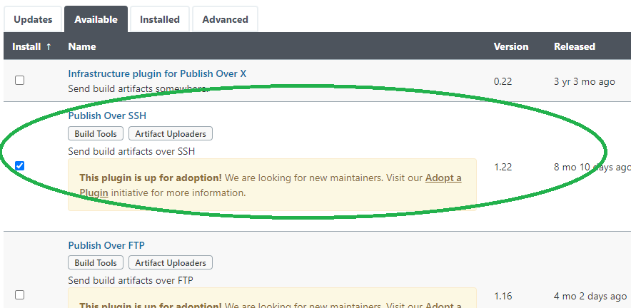
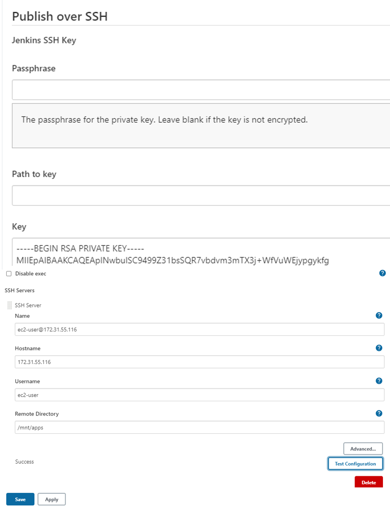
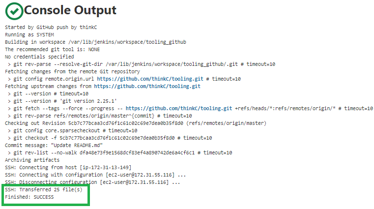

<!-- Automating with Continous Integration using Jenkins on Tooling Web Application. -->

# Automating the Deployment of Tooling Web Application with Continuous Integration using Jenkins

## Step 1 - Install and configure Jenkins Server

1. Create an AWS EC2 server running Ubuntu server 20.04 LTS and name it `Jenkins`.


Create a security group named jenkins-sg and allow inbound port 22 for SSH


2. Next, we connect to the _Jenkins_ server vai SSH and install JDK (since Jenkins is a Java based application).

```bash
sudo apt update
sudo apt install default-jdk-headless
```

3. Install Jenkins

```bash
wget -q -O - https://pkg.jenkins.io/debian-stable/jenkins.io.key | sudo apt-key add -
sudo sh -c 'echo deb https://pkg.jenkins.io/debian-stable binary/ > \
    /etc/apt/sources.list.d/jenkins.list'
sudo apt update
sudo apt-get install jenkins
```

Make sure Jenkins is up and running.

```bash
sudo systemctl status jenkins
```

output

```bash
● jenkins.service - LSB: Start Jenkins at boot time
     Loaded: loaded (/etc/init.d/jenkins; generated)
     Active: active (exited) since Sat 2021-07-10 21:05:14 UTC; 2min 4s ago
       Docs: man:systemd-sysv-generator(8)
      Tasks: 0 (limit: 1160)
     Memory: 0B
     CGroup: /system.slice/jenkins.service
```
4. Jenkins server uses TCP port 8080 . Allow inbound rule for this port on the Jenkins server security group that was created earlier.


5. Perform intial Jenkins setup

From the browser we access http://<Jenkins-Server-Public-IP-Address-or-Public-DNS-Name>:8080

`http://3.238.34.210:8080`

Note: We will be prompted to provide a default admin password
.

To retrieve the passord from the `Jenkins` server run the code below to retrieve it.

```bash
sudo cat /var/lib/jenkins/secrets/initialAdminPassword
```

output

```bash
9863a14928474fb39933c8f6d5f55ae7
```
It will then ask us to customize jenkins by installing suggested pluggins/ Click install suggested pluggins. Once, pluggins are installed we will then create admin user and get our Jenkins server address
.

Jenkins server address


`http://3.238.34.210:8080/`

Jenkins now ready


## Step 2 - Configure Jenkins to retrieve source codes from GitHub using Webhooks

1. Next, we will configure webhook on Github to trigger push event and execute _build_ task to retrieve codes from Github and to it locally on Jenkins server.

Add `http://3.238.34.210:8080/github-webhook/` for the payload URL and choose `application/json` as content type.


2. Create a Jenkins freestlye project as below. name it `tooling_github`


Next, we connect to our Github repository , and copy the tooling repo URL `https://github.com/thinkC/tooling.git`


Next, we choose Git under _Source Code Management_ in Jenkins and paste the copied github url. Since the repo is public we do not need to provide our Github credentials. We click save.


Next, we click build now to build the job manually for now, if done correctly it should be successful and shows #1 as green and we can also click on #1 and click on console output to view it. 


Next, we will reconfigure the build we did above to be triggered from GitHub webwook.

Under Build Triggers, click on `GitHub hook trigger for GITScm polling`.


Under Post-build Actions choose _archive the artifacts_ and type `**` to include all files and save.


Next, we go to GitHub to update our readme file and commit the changes to the master branch. This change should automatically trigger a build preocess on our Jenkins server by the Github webhook 

Second job below was automatically triggered by webhook


To get list of jobs on or Jenkins server

run `ls /var/lib/jenkins/jobs`

output

```bash
tooling_github
```

Next, we will now configure Jenkins to copy files to NFS server via SSH.

## Step 3 - Configure Jenkins to copy files to NFS server via SSH

1. Install "Publish Over SSH" plugin
Next, we will copy our artifacts saved locally on the Jenkins server to our NFS Server `/mnt/apps` directory. To do this we will install _Publish over SSH Plugin_ on our Jenkins server.

On the main dashboard click _Manage Jenkins_ -> and click _Manage Plugin_ . Search for [Publish over SSH](https://plugins.jenkins.io/publish-over-ssh/) and click install without restart.



Plugin succesfully installed


2. Configure the job/project to copy artifacts over to NFS server.

On the Mian Dashboard click on _Manage Jenkins_ and click on configure system.

Next, we scroll down to _Publish over SSH plugin_ and configure it to connect to NFS server.

Provide the following
1. Get the SSH key (content of .pem) used to connect to NFS or Jenkins server . Do `cat and .pem file name` .
2. Name : `ec2-user@172.31.55.116`
3. Hostname `172.31.55.116` - This is the private IP address of the NFS server
4. Username `ec2-user`
5. Remote Directory - `/mnt/apps` . This is the directory our web servers use as a mounting point to retrieve files from the NFS Server.

We now test configuration to be sure it successful and also allow port 22 for SSH on teh NFS server and save.



Next, we open the Jenkins project configuration page and add another _Post-Build Action_ .


We now configure it to send all files and directories hence the use of `**`.
<!-- Check out more pattern to choose which files to send [here](http://ant.apache.org/manual/dirtasks.html#patterns) -->


To test, we make some changes on our readMe on GitHub so that it triggers a build process on the Jenkins server.
The build prcess starts automatically and successfully transfered files as seen below.



**Note:**  Initially I had a permissioned denied error message when Jenkins eas trying to copy the files and directories to the NFS server. The reason was because /mnt/apps was owned by the root, so I had to change ownership to _ec2-user_.

/mnt/apps - originally owned by root
```bash
[ec2-user@ip-172-31-55-116 ~]$ ls -l /mnt
total 0
drwx------. 4 root root 176 Jul 12 00:06 apps
drwx------. 2 root     root      41 Jul  9 00:37 logs
drwxrwxrwx. 2 nobody   nobody     6 Jul  7 10:52 opt
```

/mnt/apps - later changed to ec2-user 
```bash
drwx------. 4 ec2-user ec2-user 176 Jul 12 00:06 apps
drwx------. 2 root     root      41 Jul  9 00:37 logs
drwxrwxrwx. 2 nobody   nobody     6 Jul  7 10:52 opt
```
To compare what was copied on the GitHub to copy on NFS server. As seen below, copy is the same. Copy was successful.
GitHub commits


README.md on the NFS server
.

Congratulations, we just implemented a continous integration solution using Jenkins CI!.